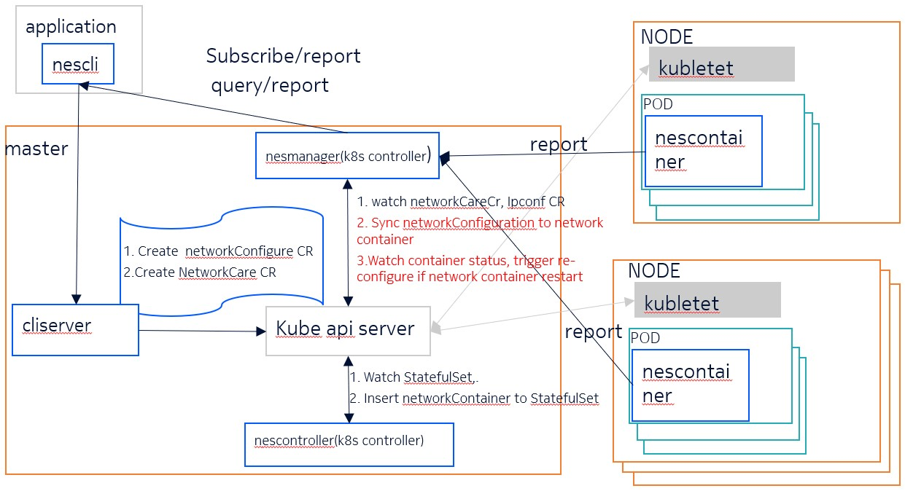

# requirements
- As an user,  I want to configure network configurations runtime 
- As an user, I want to subscribe network configurations status
- As an user, I want to query network configurations status runtime
- As an operator, I want to support network operator module upgrade separately without affect on application(user) 
- As an operator, I want to re-configuration network configuration if pods restart happen
- As an operator, I want to cleanup Kubernetes network CR if the CR's owner is deleted


## Description


This feature is used to configure network configurations runtime(detail refer to requirements)
It is split into 5 child module: nescli, cliserver, nesmanager, nescontroller and nescontainer.
### nescli
it is a binary that is called by application.
it provice following APIs:
- Configure network configuration(can replace by curl)
- Subscribe network status(can replace by curl)
- Network status query
### nescliserver
Provide restfulAPI to nescli, and is responsible for creating networkConfiguration CR and networkCare CR
  - networkConfiguration CR is include network configuration(vlan/ip/route……), generated from the requests from nescli
    1. CR's owner is StatefulSet's name that POD belong to, this make sure the networkConfigure CR can be deleted when delete the StatefulSet
    2. the CR's name is same with Pod's name,  the configuration that belong to same pods will be merge into one CR, this make sure as few configuration requests as possible by 
  - networkCare CR is about the network status subscriber's description, CR's name the subscriber`s name, this is to makesure NetworkCare CR is cleaned when the application is removed
### nescontroller
 nescontroller is responsible for inserting nescontainer to StatefulSet that need to configure network configuration runtime. the StatefulSet is identify by label: "network-config/runtime-ip": "true"

### nesmanager
nesmanager is used as controller to watch StatefulSet, Pods and CR. it has following function:
 - Network configuration
   1. Watch networkConfiguration CR, and sync the network configuration to network container, the CR's name is same with pod's name
   2. Update status of networkConfiguration CR with network container`s responce
   3. Watch network container`s status, if restart happen, reconfigure network container
 - Network status
    1. Watch networkCare CR
    2. Subscribe network status to network container
    3. Report network status to application that interesting in
    4. Support network status query runtime
### nescontainer
  nescontainer work together with user, it include following function:
  - Configure network configuration to linux
  - Retry if need
  - Watch network status by netlink ane report to network manager
  - Support network status query

## Getting Started

### Prerequisites
- go version v1.22.0+
- docker version 17.03+.
- kubectl version v1.11.3+.
- Access to a Kubernetes v1.11.3+ cluster.

### To Deploy on the cluster
**Build and push your image to the location specified by `IMG`:**

```sh
make docker-build docker-push IMG=<some-registry>/example:tag
```

**NOTE:** This image ought to be published in the personal registry you specified.
And it is required to have access to pull the image from the working environment.
Make sure you have the proper permission to the registry if the above commands don’t work.

**Install the CRDs into the cluster:**

```sh
make install
```

**Deploy the Manager to the cluster with the image specified by `IMG`:**

```sh
make deploy IMG=<some-registry>/example:tag
```

> **NOTE**: If you encounter RBAC errors, you may need to grant yourself cluster-admin
privileges or be logged in as admin.

**Create instances of your solution**
You can apply the samples (examples) from the config/sample:

```sh
kubectl apply -k config/samples/
```

>**NOTE**: Ensure that the samples has default values to test it out.

### To Uninstall
**Delete the instances (CRs) from the cluster:**

```sh
kubectl delete -k config/samples/
```

**Delete the APIs(CRDs) from the cluster:**

```sh
make uninstall
```

**UnDeploy the controller from the cluster:**

```sh
make undeploy
```

## Project Distribution

Following are the steps to build the installer and distribute this project to users.

1. Build the installer for the image built and published in the registry:

```sh
make build-installer IMG=<some-registry>/example:tag
```

NOTE: The makefile target mentioned above generates an 'install.yaml'
file in the dist directory. This file contains all the resources built
with Kustomize, which are necessary to install this project without
its dependencies.

2. Using the installer

Users can just run kubectl apply -f <URL for YAML BUNDLE> to install the project, i.e.:

```sh
kubectl apply -f https://raw.githubusercontent.com/<org>/example/<tag or branch>/dist/install.yaml
```

## Contributing
// TODO(user): Add detailed information on how you would like others to contribute to this project

**NOTE:** Run `make help` for more information on all potential `make` targets

More information can be found via the [Kubebuilder Documentation](https://book.kubebuilder.io/introduction.html)

## License

Copyright 2024.

Licensed under the Apache License, Version 2.0 (the "License");
you may not use this file except in compliance with the License.
You may obtain a copy of the License at

    http://www.apache.org/licenses/LICENSE-2.0

Unless required by applicable law or agreed to in writing, software
distributed under the License is distributed on an "AS IS" BASIS,
WITHOUT WARRANTIES OR CONDITIONS OF ANY KIND, either express or implied.
See the License for the specific language governing permissions and
limitations under the License.

